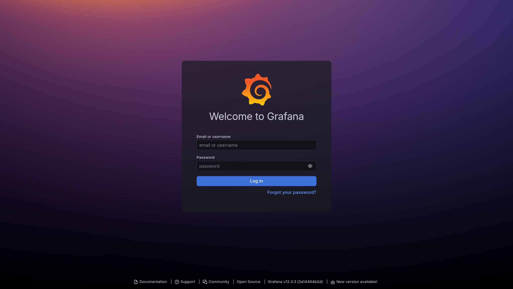
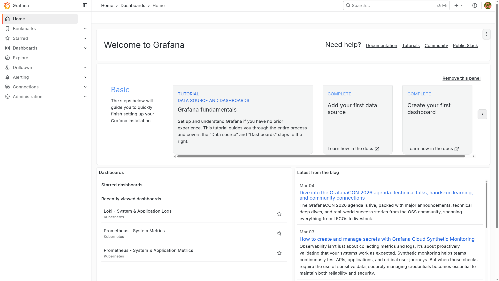
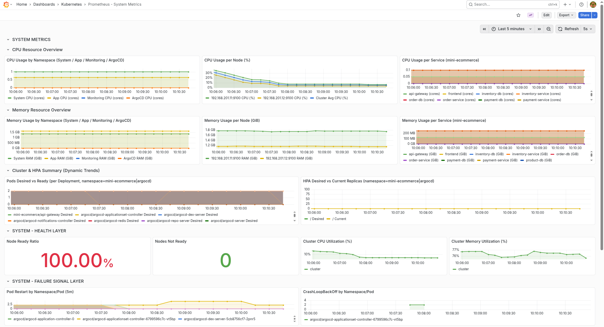
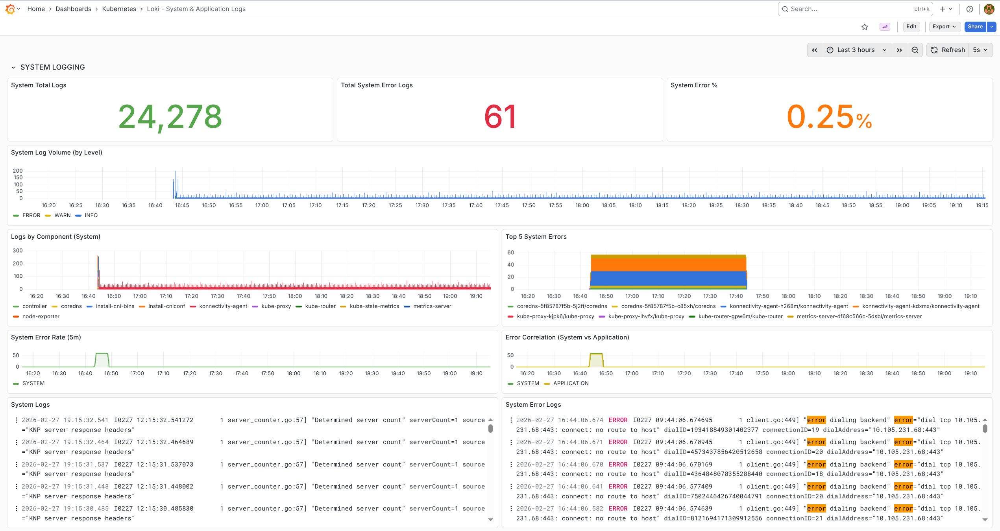
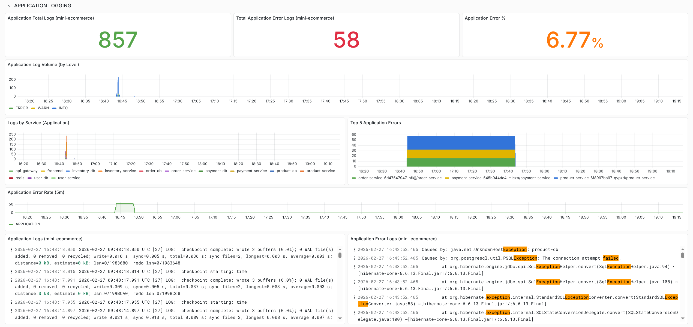
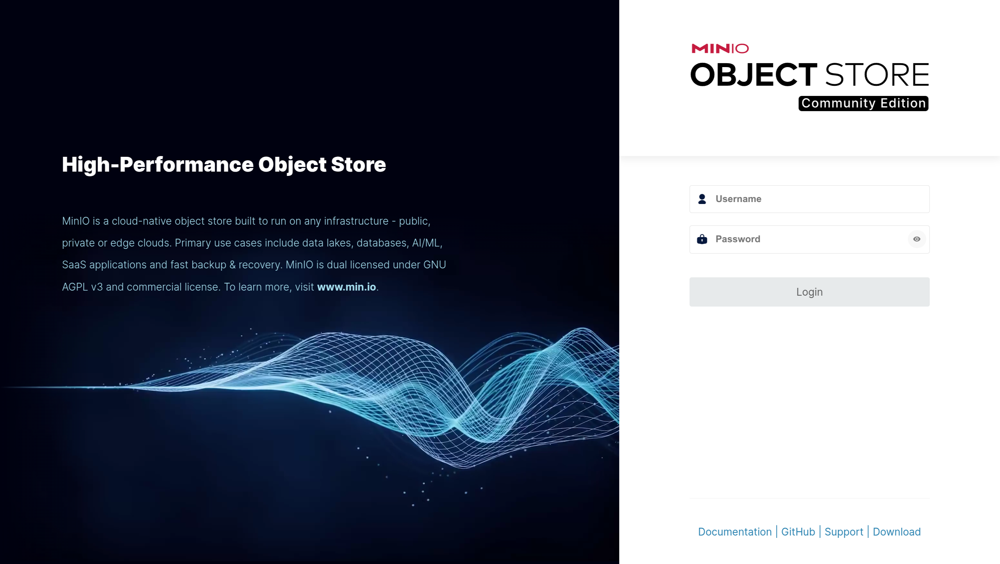

# Ansible Hub for Automation Configuration

## 1. Overview

Ansible Hub centralizes playbooks and roles to automate K0s, Observability, OpenVPN, and related components. The goal is to standardize deployment, make it easy to extend, and simplify troubleshooting.

## 2. Configuration Details

### 2.1 OpenVPN Server
Example command for the staging environment:

```bash
ansible-playbook -i inventories/staging/openvpn.ini playbooks/openvpn_setup.yml
```

Connect to the infrastructure after the configuration is completed:

```bash
sudo openvpn --config /ansible-hub/vpn/devops.ovpn
```

### 2.2 Kubernetes (k0s)
Configure the Kubernetes cluster:

```bash
ansible-playbook -i inventories/staging/kubernetes.ini playbooks/k0s_setup.yml
```

Then fetch the latest kubeconfig from the controller and connect to the cluster:

```bash
ssh -i ../key_pair/k0s_key ubuntu@<MASTER_IP> 'sudo cat /var/lib/k0s/pki/admin.conf' > ~/.kube/k0s-cloud-staging.yaml
sed -i 's#https://localhost:6443#https://<MASTER_IP>:6443#' ~/.kube/k0s-cloud-staging.yaml
export KUBECONFIG=~/.kube/k0s-cloud-staging.yaml
kubectl get nodes -o wide
kubectl get ns
```

Example:

```bash
ssh -i ../key_pair/k0s_key ubuntu@10.0.11.10 'sudo cat /var/lib/k0s/pki/admin.conf' > ~/.kube/k0s-cloud-staging.yaml
sed -i 's#https://localhost:6443#https://10.0.11.10:6443#' ~/.kube/k0s-cloud-staging.yaml
export KUBECONFIG=~/.kube/k0s-cloud-staging.yaml
kubectl get nodes -o wide
kubectl get ns
```

For the staging environment, the ingress-nginx HTTP NodePort is pinned to `30293` so the AWS ALB target group can forward traffic consistently without changing Terraform.

### 2.3 Observability
Observability is deployed via `playbooks/observability_setup.yml` and roles under `roles/observability`.

These playbooks also use the `kubeconfig` role, so you need both:
- The observability inventory
- The Kubernetes inventory for the k0s controller

To deploy the full observability stack (Grafana, Prometheus, Loki, and Tempo), run:

```bash
ansible-playbook \
  -i inventories/staging/observability.ini \
  -i inventories/staging/kubernetes.ini \
  playbooks/observability_setup.yml
```

Or just apply monitoring (Prometheus and Grafana only):

```bash
ansible-playbook \
  -i inventories/staging/observability.ini \
  -i inventories/staging/kubernetes.ini \
  playbooks/monitoring_setup.yml
```

For Alertmanager config, run:

```bash
cp roles/observability/alertmanager/defaults/main.yml.example \
   roles/observability/alertmanager/defaults/main.yml
```

Then fill in the Telegram token and chat ID locally.

#### 2.3.1 Grafana
Dashboards are provisioned automatically from `roles/observability/grafana/files/dashboards`.

**Grafana Login**



**Grafana Console**



#### 2.3.2 Prometheus
Prometheus system metrics dashboard screenshot:



#### 2.3.3 Loki
Loki collects and queries both system logs and application logs.

**Loki Dashboard for System**
System logging dashboard screenshots are stored in `images/`:



**Loki Dashboard for Microservices**
Microservices ([mini-ecommerce](https://github.com/NT114-Q21-Specialized-Project/mini-ecommerce-microservices)) logging dashboard:



### 2.4 MinIO
MinIO is deployed via `playbooks/minio_setup.yml` and role `roles/minio`.

Use inventory generated by Terraform stack `jenkins-kvm-hub/terraform/stacks/minio`:

```bash
ansible-playbook -i inventories/dev/minio.ini playbooks/minio_setup.yml
```

Default endpoints:

- API: `http://192.168.201.30:9000`
- Console: `http://192.168.201.30:9001`

**MinIO Console Login**



Default credentials are defined in `roles/minio/defaults/main.yml` and should be changed before production use.
